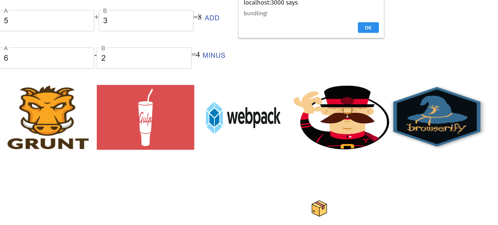

# This is a demo/template for webpack 4.
Tech Stack:

- React/ReactDOM
- HTML
- CSS/LESS/SCSS
- Webpack
- eslint
- Babel
- Yarn
- ServiceWorker (PWA)
- Material UI

## commands:
1.  First install all packages
```shell
yarn install
```
2. generate dll file(manifest.json)
```shell
npx webpack --config webpack.dll.js
```
3. bundle all files
```shell
npx webpack
```
4. run dev server
```shell
npx webpack-dev-server
```
<div>

</div>